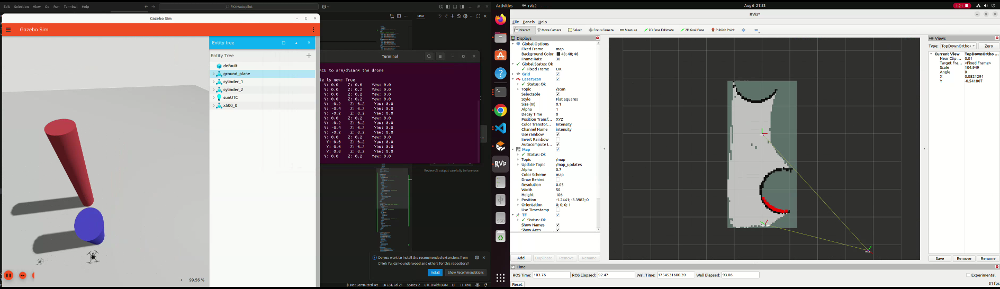

# DroneDeliverySim

The drone control is taken from [this repository](https://github.com/ARK-Electronics/ROS2_PX4_Offboard_Example?tab=readme-ov-file) by ARK Electronics.


## Demo

Drone mapping with slam toolbox. 


After flying around, it has generated a finished map.  


## Prerequisites
- ROS2 Humble
- Gazebo Harmonic 


## Setup Steps

### Install PX4


```bash
git clone https://github.com/PX4/PX4-Autopilot.git --recursive -b release/1.15
bash ./PX4-Autopilot/Tools/setup/ubuntu.sh --no-sim-tools
```

### Install Python Dependencies
Need to install the following dependencies
```bash
pip3 install --user -U empy pyros-genmsg setuptools
pip3 install kconfiglib
pip install --user jsonschema
pip install --user jinja2

```
### Micro DDS
```bash
git clone https://github.com/eProsima/Micro-XRCE-DDS-Agent.git
cd Micro-XRCE-DDS-Agent
mkdir build
cd build
cmake ..
make
sudo make install
sudo ldconfig /usr/local/lib/
```

### ROS2 Workspace 

```bash
mkdir -p ~/ros2_px4_offboard_example_ws/src
cd ~/ros2_px4_offboard_example_ws/src
```

### Clone in Packages
```bash
git clone https://github.com/PX4/px4_msgs.git -b release/1.15
git clone https://github.com/ARK-Electronics/ROS2_PX4_Offboard_Example.git
git clone https://github.com/Ymz2006/DroneDeliverySim.git
```

### Building Workspace

```bash
source /opt/ros/humble/setup.bash
#enter ws dir
colcon build
```

### ROS2 Humble Gazebo Harmonic bridge

This is to relay messages from ros2 to gazebo. For simulation purposes, we get to process lidar info from gazebo to ros2. 
[Here is the official website ](https://gazebosim.org/docs/latest/ros_installation/)

```bash
apt-get install ros-humble-ros-gzharmonic
```

### Install Navigation 2 packages

This is for robot localization and mapping

```bash
sudo apt install ros-humble-navigation2 ros-humble-nav2-bringup
sudo apt install ros-humble-slam-toolbox
```

## Launching The Simulation

First, go into project root and source the installation

```bash
source install/setup.bash
```

Next, run the velocity controller and tf publisher
```bash
ros2 launch px4_offboard offboard_velocity_control.launch.py 
ros2 launch simple_odometry px4_odom_tf.launch.py 
```

Launch the bridge
```bash
ros2 run ros_gz_bridge parameter_bridge /clock@rosgraph_msgs/msg/Clock[gz.msgs.Clock
ros2 run ros_gz_bridge parameter_bridge /scan@sensor_msgs/msg/LaserScan@gz.msgs.LaserScan
```

Finally, launch slam toolbox and rviz to visualize
```bash
ros2 launch slam_toolbox online_async_launch.py slam_params_file:=./config/mapper_params_online_async.yaml

ros2 run rviz2 rviz2 --ros-args -p use_sim_time:=true
```
